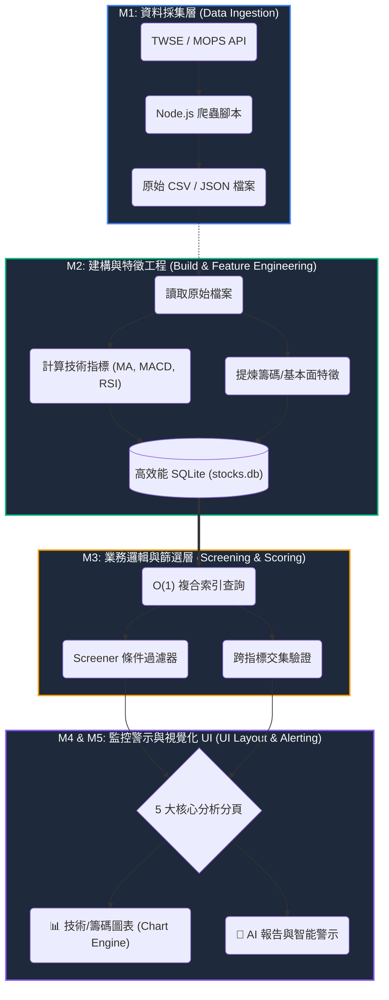

# TW Stock App — 專案憲法

> 最後更新：2026-02-25 · Version 4.0

## 一、核心模組與資料分析流程圖 (Architecture & Data Flow)

本專案採用五項核心模組架構，將原始資料轉化為可操作的金融情報：



| 模組 | 名稱             | 對應目錄與規格                         | 核心職責                                                 |
| ---- | ---------------- | -------------------------------------- | -------------------------------------------------------- |
| M1   | 資料採集層       | `001-data-ingestion/`                  | 外部 API 抓取、原始資料落地儲存 (CSV/JSON)               |
| M2   | 特徵工程層       | `001-data-ingestion/002-data-build.md` | 離線計算技術/籌碼指標，寫入 SQLite 並建立索引            |
| M3   | 選股濾鏡與權重層 | `003-screening-scoring/`               | SQL 查詢封裝、條件邏輯判斷、多面向策略濾鏡               |
| M4   | 監控與警示層     | `004-monitoring-alerting/`             | 元件狀態管理、Toast 推播、條件自動警示與通知             |
| M5   | 介面版面與動線   | `005-ui-layout/`                       | 全站跨裝置佈局 (5 大分析分頁)、組件空間劃分、UX 高級動線 |

## 二、核心原則

### I. Local-First Architecture

- Client 端使用 sql.js (WASM) + IndexedDB 實現離線存取
- Server 端使用 better-sqlite3 提供 SSR 資料
- `sqlite-service.ts` 統一資料存取層，自動判斷執行環境

### II. TypeScript Strict Mode

- 禁止 `any`（除非附帶 JSDoc 說明）
- 所有公開函式須有 JSDoc 文件註解
- ESLint + Prettier 強制程式碼品質

### III. Test-First Development

- Vitest v4 + happy-dom 測試環境
- 新功能先寫失敗測試再實作 (Red → Green → Refactor)
- lib/ 覆蓋率目標 ≥ 80%

### IV. Atomic Design & Modularity

- 採用 **Atomic Design (原子化設計)** 建立元件階層：
    - **Atoms (原子) — 11 個**: 最小功能的標記 (Badge, CyberButton, Skeleton, NavTab, SearchInput...)
    - **Molecules (分子) — 59 個**: 原子組合 (StatCard, MarketBreadth, MoverRow, StockCard...)
    - **Organisms (生物) — 27 個**: 複雜 UI 區塊 (StockScreener, TabBar, CyberCalendar, StrategicHUD...)
    - **Templates/Layouts — 2 個**: 佈局排版 (MainTerminal, BaseHead)
    - **Pages — 8 個**: 最終呈現與資料注入 (Dashboard, Screener, Live, Database, Institutional, Watchlist, Stocks...)
    - **Engine Scripts — 13 個**: 客戶端互動邏輯 (global/dashboard/live/screener/database/stocks-symbol...)
- 遵循「高內聯、低耦合」原則，UI 邏輯與業務邏輯分離
- 完整元件登記詳見 `005-ui-layout/001-system-ui-architecture.md`

### V. Quantum Terminal Design System (Premium UX)

本專案不採一般 Web UI，而是追求 **Quantum Terminal (量子終端美學)**，核心技術標準：

1. **Curated HSL Palette**: 嚴禁使用飽和度過高的純色。
    - **Deep Surface**: `hsl(240, 10%, 4%)` (Base), `hsl(240, 6%, 10%)` (Component Surface).
    - **Accents**: `hsl(217, 91%, 60%)` (Action), `hsl(142, 71%, 45%)` (Bullish), `hsl(346, 77%, 50%)` (Bearish).
2. **Multi-Layer Glassmorphism**:
    - **Layer 0 (Void)**: 純黑底層，帶有微弱的雜訊 (Noise) 質感。
    - **Layer 1 (Frosted)**: `backdrop-blur-3xl bg-white/[0.03] border-white/5`.
    - **Layer 2 (Elevated)**: `shadow-[0_0_40px_rgba(0,0,0,0.5)] border-white/10`.
3. **Typography (Data-Centric)**:
    - **UI/Headings**: `Geist Sans` 或 `Inter` (900 Weight for Labels).
    - **Numbers**: `Monaspace Neon` 或 `JetBrains Mono` (嚴格對齊，便於比較數值)。
4. **Micro-Interactions (Motion)**:
    - 全站使用 `Framer Motion` 或 `View Transitions` 處理狀態切換，動畫曲線統一為 `cubic-bezier(0.16, 1, 0.3, 1)` (Expo-Out)。
5. **Interactive Glows**: 游標懸停處應觸發半徑 300px 的動態光暈，提升視覺層次。

### VI. Performance & Integrity Standards

- LCP < 0.8s, FPS 穩定 60 (WebGL Layer)。
- **Zero CLS**: 所有異步組件必須有精確高度的 Skeleton。
- **Fail-Safe UI**: 所有資料映射必須具備可選鏈 (`?.`) 與 Default Fallback，禁出現 `undefined` 字樣。
- **SQLite 優化**: Prepared Statement Cache、WAL mode、mmap 3GB、temp_store MEMORY、synchronous OFF。
- **API Cache**: Cache-Control headers (30s POST / 60s GET screener)。
- **Client Font**: 非阻塞 preload + script-based 升級 (消除 FOIT)。
- **SW v4 分層快取**: Cache-First 靜態 / Stale-While-Revalidate 數據 / Network-First HTML。
- **Build 分割**: Vite manual chunk splitting (vendor/sqljs/chart/indicators)，ES2022 target。

### VII. Strict Specification Adherence

- **規格絕對至上**：系統中不該存在於規劃外（`.specify/specs/`）的程式碼與元件。如果某項多餘元件或功能必須留存，就**必須先正式納入規格規劃中**，確保規格與實作的一致性（Single Source of Truth）。

## 三、技術棧

| 類別        | 技術                             | 版本     |
| ----------- | -------------------------------- | -------- |
| Framework   | Astro                            | ^5.16.15 |
| SSR Adapter | @astrojs/node                    | ^9.5.2   |
| Client DB   | sql.js (WASM)                    | ^1.13.0  |
| Server DB   | better-sqlite3                   | ^12.6.2  |
| Charts      | ChartGPU                         | ^0.1.6   |
| Testing     | Vitest + happy-dom               | ^4.0.18  |
| Linting     | ESLint + @typescript-eslint      | ^9.x     |
| Formatting  | Prettier + prettier-plugin-astro | ^3.x     |

## 四、架構決策紀錄 (ADR)

| ADR | 決策                                       | 狀態        |
| --- | ------------------------------------------ | ----------- |
| 001 | 採用 sql.js + IndexedDB 作為 Client 端儲存 | ✅ 已實施   |
| 002 | 採用 Astro v5 + @astrojs/node SSR          | ✅ 已實施   |
| 003 | ChartGPU GPU 加速圖表渲染                  | ✅ 已實施   |
| 004 | CSV → SQLite 遷移 (800ms → <50ms)          | ✅ 已完成   |
| 005 | 效能模式四級偵測 (high/medium/low/minimal) | ⚠️ 部分實施 |
| 006 | 選股篩選器本地優先執行                     | ✅ 已實施   |
| 007 | SQLite 效能調校 (WAL + Stmt Cache + mmap)  | ✅ 已實施   |
| 008 | PWA Service Worker v4 分層快取策略         | ✅ 已實施   |
| 009 | SSR/SSG 雙模建置 (STATIC_BUILD env var)    | ✅ 已實施   |
| 010 | GitHub Pages 靜態部署 (deploy-pwa.yml)     | ✅ 已實施   |

## 五、測試狀態

| 狀態           | 模組                                                                                                                                                                                                                                                                                                  |
| -------------- | ----------------------------------------------------------------------------------------------------------------------------------------------------------------------------------------------------------------------------------------------------------------------------------------------------- |
| ✅ 已測試 (24) | analysis, indicators, database, stock-service, cache, cache-manager, csv-export, sqlite-service, screener, data-sync, performance-mode, twse-api, export, user-account, request-cache, toast, keyboard, lazy-load, data-import, data-loader, chart-tooltip, pwa, screener-local, performance-baseline |
| ❌ 未測試 (0)  | —                                                                                                                                                                                                                                                                                                     |

## 六、已知技術債

1. 13 個 lib 模組無測試（覆蓋率 46%）
2. SPA 導覽事件監聯器堆疊（組件未冪等初始化）
3. twse-api.ts 缺乏重試 / backoff 機制
4. stock-service.ts 部分使用 any 型別
5. Mobile viewport 100vh 佈局跳動（已改用 `100dvh`）
6. IndexedDB 容量未監控
7. GitHub Pages 靜態建置時 API routes 不可用（需 SSR server）
8. `_deprecated/` 資料夾尚未清除

## 七、SDD 開發工作流與輔助腳本 (Workflow & Automation)

我們的開發嚴格遵循 Spec-Driven Development (SDD) 架構。為確保架構不偏移，所有新功能的發起與驗證，都必須透過 `.specify/scripts/powershell/` 中的自動化腳本進行把關：

```
1. 啟動 (Specify) → 2. 釐清 (Clarify) → 3. 計畫 (Plan) → 4. 拆解 (Tasks) → 5. 實作 (Implement)
```

### 輔助腳本使用時機：

| 步驟        | 觸發腳本 / 時機              | 腳本功能說明                                                                                                                               |
| :---------- | :--------------------------- | :----------------------------------------------------------------------------------------------------------------------------------------- |
| **1. 啟動** | `./create-new-feature.ps1`   | 當接到新需求時執行。自動根據需求名稱建立 Branch，並建立 `specs/.../000-overview.md` 總覽規格書。                                           |
| **2. 釐清** | `./setup-clarify.ps1`        | 在撰寫程式前的架構盲區探討。自動產生 `_[prefix]-clarification.md` 逼迫開發者填寫資料來源、邊界條件與效能 O(N) 評估。                       |
| **3. 計畫** | `./setup-plan.ps1`           | 釐清需求後執行。生成 `_[prefix]-plan.md` 實作計畫，決定要新增哪些檔案與函數介面。                                                          |
| _(同步)_    | `./update-agent-context.ps1` | 自動讀取 `_[prefix]-plan.md` 的變更，更新全專案的 `.cursorrules` / `CLAUDE.md` 等 AI Agent 上下文，讓所有 AI 保持資訊同步。                |
| **4. 驗證** | `./check-prerequisites.ps1`  | **必經之門**。在正式動手寫 Code 之前，檢查是否已確實繳交 `_[prefix]-clarification.md` 與 `_[prefix]-plan.md`。若未完成，拒絕進入實作階段。 |
| **5. 拆解** | `./setup-tasks.ps1`          | **(新加入)** 通過防呆後執行。自動產生 `_[prefix]-tasks.md` 工單，把計畫轉化成工程師與 AI 的 Checklist。                                    |

## 八、命名與資料夾規範

### 命名慣例

| 項目            | 範例                             | 說明                                             |
| --------------- | -------------------------------- | ------------------------------------------------ |
| 模組概述檔案    | `000-data-ingestion-overview.md` | 以 `000-[模組名稱]-overview.md` 取代 `README.md` |
| 規格文件        | `001-data-sources.md`            | `[流水號]-[功能名稱].md`                         |
| Astro 元件      | `StockCard.astro`                | PascalCase (大駝峰)                              |
| TypeScript 檔案 | `stock-service.ts`               | kebab-case (烤肉串)                              |
| 測試檔案        | `analysis.test.ts`               | `{filename}.test.ts`                             |
| 變數與函式      | `getTopGainers()`                | camelCase (小駝峰)                               |
| 類型與介面      | `StockFullData`                  | PascalCase (大駝峰)                              |
| 常數            | `MAX_RETRY`                      | UPPER_SNAKE_CASE (大寫蛇形)                      |

### 資料夾結構

- `src/pages/`: 路由與頁面接入點 (M4)
- `src/layouts/`: 頁面排版模板 (`MainTerminal.astro`)
- `src/components/`: 可重用 UI 元件 (M4)
    - `atoms/`: 基礎標記 (Icons, Badges)
    - `molecules/`: 組合單元 (PageHero)
    - `organisms/`: 業務功能塊 (StockScreener, MoversPanel)
- `src/lib/`: 核心業務邏輯、資料服務、儲存介面、分析引擎 (M1, M2, M3)
- `src/data/`: 靜態資料定義與型別宣告 (M3)
- `src/styles/`: 全域樣式 (`terminal.css`)、Tokens、設計系統實作 (M4)
- `src/utils/`: 通用輔助工具
- `scripts/`: 資料抓取與建構腳本 (M1)
- `public/data/`: 下載與建構後的原始資料 (M1)

## 九、Tailwind 響應式設計規範 (Responsive Design)

本專案採用 **Mobile-First** 策略，確保在小螢幕上依然具備終端機之高效讀取體驗：

### 1. 響應式中斷點 (Breakpoints)

- **Mobile (`< 768px`)**: 單欄式垂直佈局，隱藏次要 Sparklines，主要內容佔滿寬度。
- **Tablet (`md`: 768px ~ 1024px)**：雙欄或 Grid 2 佈局，顯示部分技術指標。
- **Desktop (`lg`: 1024px ~ 1280px)**：開啟 `MainTerminal` 側邊導航列，顯示完整資料表格。
- **UltraWide (`xl`+)**: 三欄式佈局，左側導航、中央主視圖、右側細節分析面板。

### 2. 佈局工具 (Layout Utilities)

- **Viewport Height**: 一律使用 `h-screen` 或 `h-[100dvh]` 確保手機瀏覽器網址列縮放時版面穩定。
- **Grid Patterns**:
    - `grid-cols-1 md:grid-cols-2 lg:grid-cols-3` 用於卡片清單。
    - `flex flex-col lg:flex-row` 用於側邊欄與內容區塊切換。
- **Visibility**:
    - `hidden md:flex`: 隱藏桌面端才需要的豪華裝飾（如複雜的背景光暈）。
    - `truncate`: 長標題必備，防止資料欄位撐破版面。

### 3. 排版密度 (Density)

- **Mobile**: `p-4`, `gap-4` 確保觸控點準確。
- **Desktop**: `p-3`, `gap-2` (Terminal-Density)，在同樣空間塞入更多數據。
