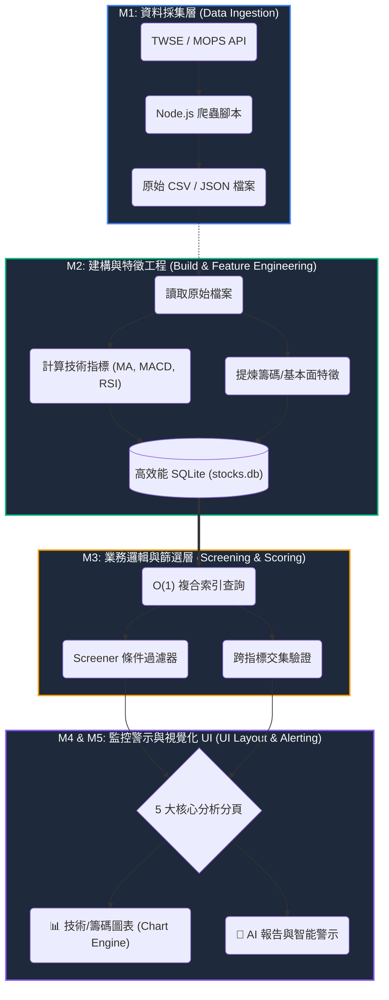

# TW Stock App — 專案憲法

> 最後更新：2026-02-22 · Version 3.0

## 一、核心模組與資料分析流程圖 (Architecture & Data Flow)

本專案採用五項核心模組架構，將原始資料轉化為可操作的金融情報：



| 模組 | 名稱 | 對應目錄與規格 | 核心職責 |
|----|------|----------|----------|
| M1 | 資料採集層 | `001-data-ingestion/` | 外部 API 抓取、原始資料落地儲存 (CSV/JSON) |
| M2 | 特徵工程層 | `001-data-ingestion/002-data-build.md`| 離線計算技術/籌碼指標，寫入 SQLite 並建立索引 |
| M3 | 選股濾鏡與權重層 | `003-screening-scoring/` | SQL 查詢封裝、條件邏輯判斷、多面向策略濾鏡 |
| M4 | 監控與警示層 | `004-monitoring-alerting/` | 元件狀態管理、Toast 推播、條件自動警示與通知 |
| M5 | 介面版面與動線 | `005-ui-layout/` | 全站跨裝置佈局 (5 大分析分頁)、組件空間劃分、UX 高級動線 |

## 二、核心原則

### I. Local-First Architecture
- Client 端使用 sql.js (WASM) + IndexedDB 實現離線存取
- Server 端使用 better-sqlite3 提供 SSR 資料
- `sqlite-service.ts` 統一資料存取層，自動判斷執行環境

### II. TypeScript Strict Mode
- 禁止 `any`（除非附帶 JSDoc 說明）
- 所有公開函式須有 JSDoc 文件註解
- ESLint + Prettier 強制程式碼品質

### III. Test-First Development
- Vitest v4 + happy-dom 測試環境
- 新功能先寫失敗測試再實作 (Red → Green → Refactor)
- lib/ 覆蓋率目標 ≥ 80%

### IV. Atomic Design & Modularity
- 採用 **Atomic Design (原子化設計)** 建立元件階層：
  - **Atoms (原子)**: 最小功能的標記 (Button, Input, Icon)
  - **Molecules (分子)**: 原子組合 (SearchField, StatsItem)
  - **Organisms (生物)**: 複雜 UI 區塊 (StockCard, MultiChart, Navigation)
  - **Templates (模板)**: 佈局排版 (PageLayout, SidebarLayout)
  - **Pages (頁面)**: 最終呈現與資料注入
- 遵循「高內聚、低耦合」原則，UI 邏輯與業務邏輯分離

### V. Premium Web App Design & UX
本專案不採原型開發 (MVP) 標準，而是追求 **Premium Financial Terminal (高級金融終端美學)**，核心包含：
1. **Glassmorphism (玻璃擬態)**：利用深藍黑基底 (`backdrop-filter`) 建構深色模式的多層次空間感。
2. **Vibrant Accents (高對比強調色)**：捨棄單調純色，改用**玫瑰紅 (Rose Red)** 代表下跌、**豔青綠 (Vibrant Green)** 代表上漲，配合明亮的品牌藍進行操作引導。
3. **Dynamic Micro-Animations (動態微動效)**：全站組件須具備優雅的懸停特效 (Hover Effects)、淡入浮現 (Reveal Animations) 與游標光暈追蹤 (`glow-effect`)。
4. **Accessibility**：支援 ARIA 標籤、鍵盤導航 (如 Ctrl+K)、符合 WCAG 2.1 AA 標準。
5. **穩健狀態切換**：各元件必須有對應的 Shimmer 骨架屏載入狀態與完整的 ErrorBoundary 錯誤邊界，確保資料加載時版面不跳動。

### VI. Performance Standards
- LCP < 1.5s, FID < 100ms, CLS < 0.1, FPS ≥ 55
- **效能分級降級 (Performance-Aware UI)**：自動依硬體偵測關閉高耗能之 GPU 模糊渲染，保護低端裝置流暢度。
- 禁止 `mousemove` 頻繁執行 DOM 查詢 (`querySelectorAll`)，優先使用 CSS Variables 紀錄游標位置。
- CSS 動畫僅使用 `transform` 與 `opacity` 以觸發 GPU 加速。

### VII. Strict Specification Adherence
- **規格絕對至上**：系統中不該存在於規劃外（`.specify/specs/`）的程式碼與元件。如果某項多餘元件或功能必須留存，就**必須先正式納入規格規劃中**，確保規格與實作的一致性（Single Source of Truth）。

## 三、技術棧

| 類別 | 技術 | 版本 |
|------|------|------|
| Framework | Astro | ^5.16.15 |
| SSR Adapter | @astrojs/node | ^9.5.2 |
| Client DB | sql.js (WASM) | ^1.13.0 |
| Server DB | better-sqlite3 | ^12.6.2 |
| Charts | ChartGPU | ^0.1.6 |
| Testing | Vitest + happy-dom | ^4.0.18 |
| Linting | ESLint + @typescript-eslint | ^9.x |
| Formatting | Prettier + prettier-plugin-astro | ^3.x |

## 四、架構決策紀錄 (ADR)

| ADR | 決策 | 狀態 |
|-----|------|------|
| 001 | 採用 sql.js + IndexedDB 作為 Client 端儲存 | ✅ 已實施 |
| 002 | 採用 Astro v5 + @astrojs/node SSR | ✅ 已實施 |
| 003 | ChartGPU GPU 加速圖表渲染 | ✅ 已實施 |
| 004 | CSV → SQLite 遷移 (800ms → <50ms) | ✅ 已完成 |
| 005 | 效能模式四級偵測 (high/medium/low/minimal) | ⚠️ 部分實施 |
| 006 | 選股篩選器本地優先執行 | ✅ 已實施 |

## 五、測試狀態

| 狀態 | 模組 |
|------|------|
| ✅ 已測試 (24) | analysis, indicators, database, stock-service, cache, cache-manager, csv-export, sqlite-service, screener, data-sync, performance-mode, twse-api, export, user-account, request-cache, toast, keyboard, lazy-load, data-import, data-loader, chart-tooltip, pwa, screener-local, performance-baseline |
| ❌ 未測試 (0) | — |

## 六、已知技術債

1. 13 個 lib 模組無測試（覆蓋率 46%）
2. SPA 導覽事件監聽器堆疊（組件未冪等初始化）
3. twse-api.ts 缺乏重試 / backoff 機制
4. stock-service.ts 部分使用 any 型別
5. Mobile viewport 100vh 佈局跳動
6. IndexedDB 容量未監控

## 七、SDD 開發工作流與輔助腳本 (Workflow & Automation)

我們的開發嚴格遵循 Spec-Driven Development (SDD) 架構。為確保架構不偏移，所有新功能的發起與驗證，都必須透過 `.specify/scripts/powershell/` 中的自動化腳本進行把關：

```
1. 啟動 (Specify) → 2. 釐清 (Clarify) → 3. 計畫 (Plan) → 4. 拆解 (Tasks) → 5. 實作 (Implement)
```

### 輔助腳本使用時機：

| 步驟 | 觸發腳本 / 時機 | 腳本功能說明 |
| :-- | :--- | :--- |
| **1. 啟動** | `./create-new-feature.ps1` | 當接到新需求時執行。自動根據需求名稱建立 Branch，並建立 `specs/.../spec.md` 規格書。 |
| **2. 釐清** | `./setup-clarify.ps1` | 在撰寫程式前的架構盲區探討。自動產生 `clarification.md` 逼迫開發者填寫資料來源、邊界條件與效能 O(N) 評估。 |
| **3. 計畫** | `./setup-plan.ps1` | 釐清需求後執行。生成 `plan.md` 實作計畫，決定要新增哪些檔案與函數介面。 |
| *(同步)* | `./update-agent-context.ps1`| 自動讀取 `plan.md` 的變更，更新全專案的 `.cursorrules` / `CLAUDE.md` 等 AI Agent 上下文，讓所有 AI 保持資訊同步。 |
| **4. 驗證** | `./check-prerequisites.ps1` | **必經之門**。在正式動手寫 Code 之前，檢查是否已確實繳交 `clarification.md` 與 `plan.md`。若未完成，拒絕進入實作階段。 |

## 八、命名與資料夾規範

### 命名慣例
| 項目 | 範例 | 說明 |
|------|------|------|
| 模組概述檔案 | `000-data-ingestion-overview.md` | 以 `000-[模組名稱]-overview.md` 取代 `README.md`，從檔名即可明確辨別資料範疇 |
| 規格文件 | `001-data-sources.md` | `[流水號]-[功能名稱].md`，依序編號定義各項系統規格 |
| Astro 元件 | `StockCard.astro` | PascalCase (大駝峰) |
| TypeScript 檔案 | `stock-service.ts` | kebab-case (烤肉串) |
| 測試檔案 | `analysis.test.ts` | `{filename}.test.ts` |
| 變數與函式 | `getTopGainers()` | camelCase (小駝峰) |
| 類型與介面 | `StockFullData` | PascalCase (大駝峰) |
| 常數 | `MAX_RETRY` | UPPER_SNAKE_CASE (大寫蛇形) |

### 資料夾結構
- `src/pages/`: 路由與頁面接入點 (M4)
- `src/layouts/`: 頁面排版模板 (M4)
- `src/components/`: 可重用 UI 元件 (M4)
  - `atoms/`: 基礎標記 (未來遷移方向)
  - `molecules/`: 組合單元
  - `organisms/`: 業務功能塊
- `src/lib/`: 核心業務邏輯、資料服務、儲存介面、分析引擎 (M1, M2, M3)
- `src/data/`: 靜態資料定義與型別宣告 (M3)
- `src/styles/`: 全域樣式、Tokens、設計系統實作 (M4)
- `src/utils/`: 通用輔助工具
- `scripts/`: 資料抓取與建構腳本 (M1)
- `public/data/`: 下載與建構後的原始資料 (M1)
