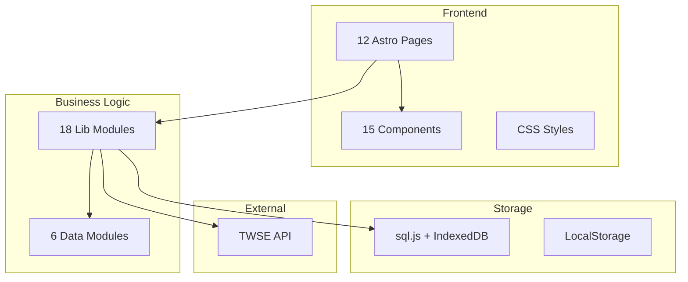

# Baseline Specification: TW Stock App

**Created**: 2026-02-01  
**Status**: Baseline  
**Version**: 0.0.1

## Project Overview

**TW Stock App** 是一個基於 Astro 的台灣股票分析平台，採用 Local-First 架構，支援 PWA 離線使用。

## Architecture Baseline

## Data Inventory

### Historical Prices Dataset

| Item | Value |
|------|-------|
| Location | `public/data/prices/` |
| Files | **1,077 CSV files** |
| Period | 5 years (2021-present) |
| Format | UTF-8, LF line endings |

**CSV Columns:**
- `Date` - 日期 (YYYY-MM-DD)
- `Open`, `High`, `Low`, `Close` - OHLC 價格
- `Volume` - 成交量 (張)
- `Turnover` - 成交金額 (元)
- `Change`, `ChangePct` - 漲跌、漲跌幅

### Supporting Data Files

| File | Description | Size |
|------|-------------|------|
| `stocks.json` | 股票清單 | 80KB |
| `latest_prices.json` | 最新報價 | 247KB |
| `price_index.json` | 價格索引 | 33KB |

### Data Documentation
- [DATA_SPEC.md](../../public/data/DATA_SPEC.md) - 完整欄位規範

## Current Feature Inventory

### Pages (12 total)

| Page | File | Description | Status |
|------|------|-------------|--------|
| 🏠 首頁 | `index.astro` | 市場概況、漲跌排行 | ✅ Complete |
| 📊 個股分析 | `stocks/` | 股票列表、搜尋 | ✅ Complete |
| 🏭 產業分類 | `industries.astro` | 15大產業分類 | ✅ Complete |
| 🎯 選股策略 | `strategies/` | 策略瀏覽 | ✅ Complete |
| 🔍 智能篩選 | `filter.astro` | 多條件篩選 | ✅ Complete |
| ⚖️ 股票比較 | `compare.astro` | 最多4檔比較 | ✅ Complete |
| 💼 投資組合 | `portfolio.astro` | 持股管理 | ✅ Complete |
| 💰 股利歷史 | `dividends.astro` | 歷年股利 | ✅ Complete |
| 📡 即時資料 | `live.astro` | TWSE即時行情 | ✅ Complete |
| ⭐ 自選股 | `watchlist.astro` | 自選清單 | ✅ Complete |
| ⚙️ 設定 | `settings.astro` | 個人設定 | ✅ Complete |

### Library Modules (18 total)

| Module | Test Coverage | Status |
|--------|---------------|--------|
| `analysis.ts` | ✅ `analysis.test.ts` | Tested |
| `indicators.ts` | ✅ `indicators.test.ts` | Tested |
| `database.ts` | ❌ No tests | Needs Tests |
| `stock-service.ts` | ❌ No tests | Needs Tests |
| `cache.ts` | ❌ No tests | Needs Tests |
| `export.ts` | ❌ No tests | Needs Tests |
| `twse-api.ts` | ❌ No tests | Needs Tests |
| `user-account.ts` | ❌ No tests | Needs Tests |
| `keyboard.ts` | ❌ No tests | Needs Tests |
| `pwa.ts` | ❌ No tests | Needs Tests |
| `toast.ts` | ❌ No tests | Needs Tests |
| `lazy-load.ts` | ❌ No tests | Needs Tests |
| `offline-export.ts` | ❌ No tests | Needs Tests |
| `data-import.ts` | ❌ No tests | Needs Tests |
| `data-loader.ts` | ❌ No tests | Needs Tests |
| `chart-tooltip.ts` | ❌ No tests | Needs Tests |

### Components (15 total)

| Component | Type | Description |
|-----------|------|-------------|
| `StockCard.astro` | Display | 股票卡片 (11KB) |
| `StockChart.astro` | Visualization | 股票圖表 (10KB) |
| `KeyboardHelp.astro` | UX | 快捷鍵說明 |
| `StrategyCard.astro` | Display | 策略卡片 |
| `Heatmap.astro` | Visualization | 熱力圖 |
| `Skeleton.astro` | Loading | 骨架屏 |
| `ChartSkeleton.astro` | Loading | 圖表骨架 |
| `ErrorBoundary.astro` | Error | 錯誤邊界 |
| `ErrorMessage.astro` | Error | 錯誤訊息 |
| `FilterBar.astro` | Input | 篩選列 |
| `NewsList.astro` | Display | 新聞列表 |
| `LoadingSpinner.astro` | Loading | 載入動畫 |
| Others | Various | 骨架元件 |

## Test Coverage Baseline

| Category | Tested | Untested | Coverage |
|----------|--------|----------|----------|
| Lib Modules | 2 | 14 | 12.5% |
| Components | 0 | 15 | 0% |
| Pages | 0 | 12 | 0% |

**Current Test Command**: `npm test`  
**Coverage Command**: `npm run test:coverage`

## Identified Improvement Areas

### High Priority
1. **Test Coverage Gap** - 16 lib modules lack tests
2. **Database Tests** - Critical `database.ts` untested
3. **API Tests** - `twse-api.ts` needs mocking & tests

### Medium Priority
4. **Component Tests** - 15 components untested (need happy-dom)
5. **E2E Tests** - No integration tests for user flows
6. **TypeScript Strict** - Verify strict mode compliance

### Low Priority
7. **Documentation** - JSDoc missing in most modules
8. **Performance** - Lazy loading could be optimized

## Success Criteria for Baseline Phase

- **SC-001**: Document all existing modules with status
- **SC-002**: Identify test coverage gaps
- **SC-003**: Prioritize improvement backlog
- **SC-004**: Create foundation for future specifications
